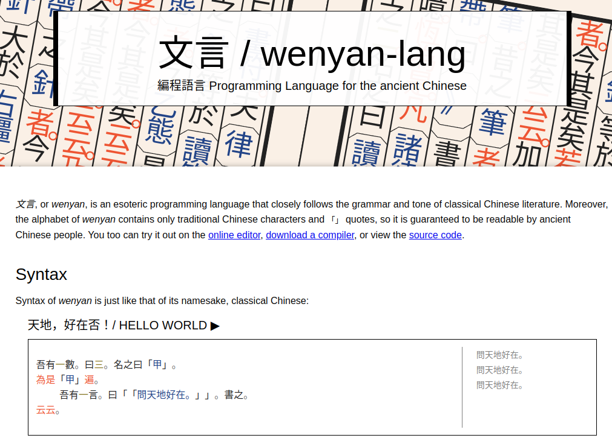
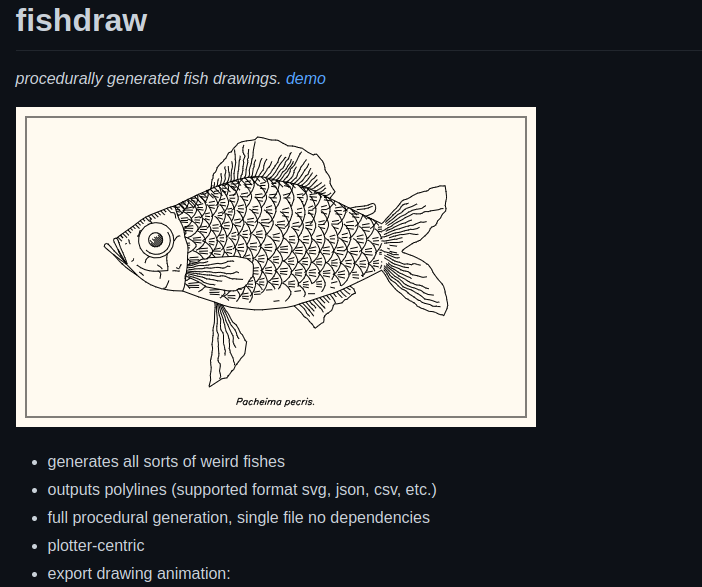
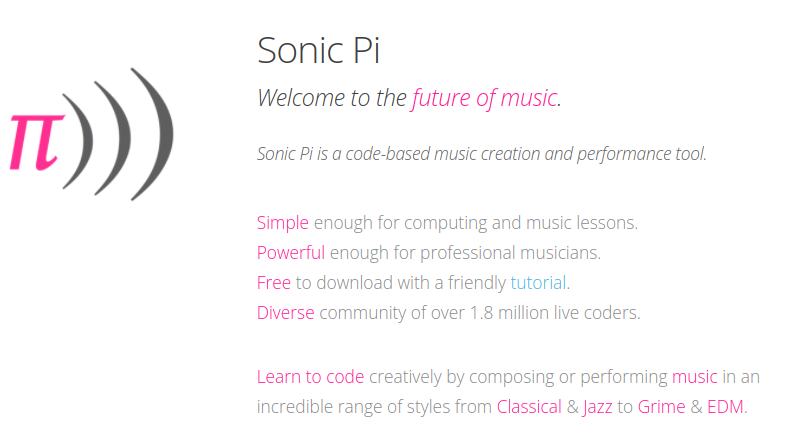
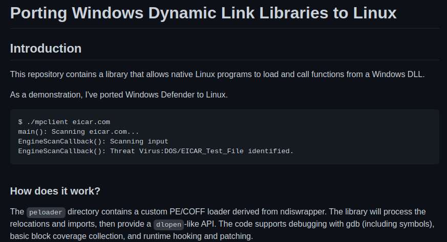

# weird-n-awsome
This repo is the note for what I found in the internet, mostly from github. The stuff that look weird and awsome at the same time.

## Pgramming Language for the ancient Chinese
Did you ever wonder what if programming language is written in Chinese would look like? This website is for you 
https://wy-lang.org/

## fishdraw - generates all sorts of weird fishes
https://github.com/LingDong-/fishdraw

## Sonic Pi - create music with code
You love coding and create music at the same time? Sonic Pi is for you 
https://sonic-pi.net/

## Running Windows Defender in Linux
But why? Yeah why do we need to run Windows Defender in Linux? Ok we dont need that, but this project is not only for running Windows Defender in Linux but also for: 

"Allows native Linux programs to load and call functions from a Windows DLL"

https://github.com/taviso/loadlibrary

